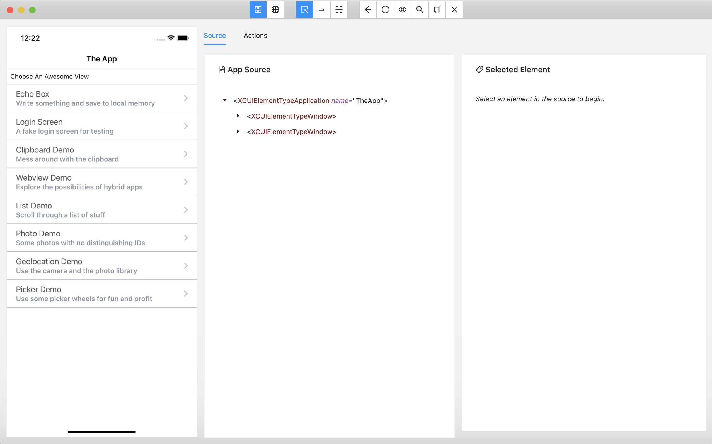

# Appium Inspector

A GUI inspector for mobile apps and more, powered by a (separately installed) Appium server. When you're using it to inspect a mobile app, it looks like this:

Appium Inspector is basically just an Appium client (like WebdriverIO, Appium's Java client, Appium's Python client, etc...) with a user interface. There's an interface for specifying which Appium server to use, which capabilities to set, and then interacting with elements and other Appium commands once you've started a session.

## Important migration notes

This version of Appium Inspector is designed to work with Appium 2.0 as a default. So if you are migrating from Appium Desktop (which is designed to work with Appium 1.x as a default), you need to be aware of some changes:

* The default remote server path has changed from `/wd/hub` to `/` to reflect Appium 2.0's default server path. If you're using Appium Inspector with an Appium 1.x server, you'll likely need to update the path information in the New Session form back to `/wd/hub`.

## Installation

Appium Inspector is released in two formats:

1. As a desktop app for macOS, Windows, and Linux. You can get the most recent published version of this app at the [Releases](https://github.com/appium/appium-inspector/releases) section of this repo. Simply grab the appropriate version for your OS and follow standard installation procedures (but see the note below for macOS).
2. As a [web application](https://inspector.appiumpro.com), hosted by [Appium Pro](https://appiumpro.com). (It's currently a [known issue](https://github.com/appium/appium-inspector/issues/103) that the web version does not work on Safari). Please make sure to read the note below on CORS as well.

Both apps have the exact same set of features, so you might find that simply opening the web version is going to be easier and save you on disk space (and you can keep multiple tabs open!).

### Installing on macOS

If you're using the desktop app on macOS, when you run it you will likely be greeted with some error about the app not being able to be opened, or not verified by Apple, or something similar. The easiest way to get around this is to run `xattr -cr` on the file you downloaded. So let's say you downloaded `appium-inspector.dmg` and copy `Appium Inspector.app` in `/Applications` inside the disk image. Then you would run `xattr -cr "/Applications/Appium Inspector.app"` before opening it. The same goes for the zip version (or the .app itself).

The reason for this is that the Appium team does not have a paid Apple developer account and so our app isn't signed by a certificate they recognize, so the OS attempts to prevent it from running. Running the command above gets around this security limitation.

## Features

* Easily define Appium server connection details and set up capabilities
* Save server details and capability sets for future sessions
* Connect to a variety of cloud Appium platforms
* Attach to an existing Appium session via its ID
* Inspect the screenshot and source of a mobile app. (This inspector is designed to work with iOS and Android. Other Appium platforms might also work, but they probably won't without some updates to the code here. PRs welcome!)
* Select elements via clicking on them in the screenshot
* Interact with elements (click, send keys, clear)
* Get a list of suggested element locator strategies and selectors to be used in your scripts
* Compare the speed of different element finding strategies
* Start and stop "recording" mode, which translates your actions in the Inspector to code samples you can use in your scripts
* Tap on the screen at an arbitrary location
* Perform a swipe gesture
* Switch into web context modes and interact with web elements
* Test out your own locator strategies
* Access a huge library of Appium actions to run with a simple click, including providing your own parameters

### Supported cloud platforms

|     Platform     | Docs
| ---------------- | ------|
| [Sauce Labs](https://saucelabs.com) | [Documentation](https://wiki.saucelabs.com/)            |
| [HeadSpin](https://headspin.io) | [Documentation](https://headspin.io/)                 |
| [Browserstack](https://browserstack.com) | [Documentation](https://www.browserstack.com/docs) |
| [Lambdatest](https://lambdatest.com) | [Documentation](https://www.lambdatest.com/support/docs/appium-inspector-integration) |
| [Bitbar](https://bitbar.com) | [Documentation](http://docs.bitbar.com/)                       |
| [Kobiton](https://kobiton.com) | [Documentation](https://docs.kobiton.com/)                       |
| [Perfecto](https://www.perfecto.io) | [Documentation](https://developers.perfectomobile.com/display/PD/Appium) |
| [Pcloudy](https://www.pcloudy.com) | [Documentation](https://www.pcloudy.com/mobile-application-testing-documentation) |
| [TestingBot](https://testingbot.com) | [Documentation](https://testingbot.com/support) |
| [Experitest](http://www.experitest.com) | [Documentation](https://docs.experitest.com/display/TE/Appium) |
| [Robotic.mobi](https://www.robotic.mobi) | [Documentation](https://robotic.mobi/appium-remote) |

## Requirements

As mentioned above, the Inspector is basically an Appium client, so for it to function correctly you will need:

1. A running Appium server accessible via the network by the Inspector (for example, an Appium server running on localhost, or one running on a cloud service).
2. All of the appropriate Appium drivers, plugins, and other dependencies that those might entail.

Basically, if you can start an Appium session from your typical client library, you should be able to do the same with the Inspector.

### Connecting to a local server from the browser inspector (CORS)

Web browsers have security features which prevent [cross-origin resource sharing](https://developer.mozilla.org/en-US/docs/Web/HTTP/CORS) in general. The browser version of the Inspector needs to make requests to the Appium server directly from the browser via JavaScript, but these requests are typically not made to the same host (for example, the Inspector is accessed at `appiumpro.com`, whereas your local Appium Server is `localhost:4723`).

In this scenario, you will be unable to start a session, because the browser will prevent it. To work around this limitation, you can start your Appium server with `--allow-cors`, so that the Appium server knows to send the appropriate CORS-related headers.

If you run into this issue with a cloud platform, then the cloud platform needs to update their server frontend to support the CORS scenario as well.

## Reporting issues

If you run into a problem, first ascertain whether it's a problem with the Inspector specifically or if it's a problem with Appium. The way to do that is to reproduce the issue in code, using an Appium client library. If the issue still exists, then it's not an issue with the Inspector, and it should be reported instead at the [main Appium repo](https://github.com/appium/appium/issues).

Issues that have to do with the Inspector specifically can be reported here at this repo.

## Development

Want to help us develop this app? We'd love it! Getting set up to do development is pretty easy:

1. Clone the repo
2. Clone git submodules (`git submodule update --init`)
3. Install dependencies (`npm install`)

From here, have a look at the `scripts` field of our package.json to see what kind of dev scripts you might want to run. Some of the most useful are:

* `npm test`: run basic lint and unit tests
* `npm e2e`: run E2E tests
* `npm run dev`: run the app in dev mode (will refresh when you make code changes)
* `npm run build`: build the production version of the app into `dist/`
* `npm run build:browser`: build a version of the app for web browsers  into `dist-browser/`
* `npm run start`: start the production version of the app
* `npm run clean`: remove all caches and node modules and reinstall everything
* `npx electron-builder build --publish never`: package the app for your platform (into `release/`). Note that for macOS this requires code signing environment variables to be set.

### Shared components and utilities

This app shares components and utilities with [Appium Desktop](https://github.com/appium/appium-desktop), via a third repo called [appium-gui-libs](https://github.com/appium/appium-gui-libs). This is cloned as a submodule in `gui-common`. If you need to make changes to any of that code, you'll want to first submit your PR to appium-gui-libs.

### Localization

We try to use only localized strings (`t('localizationKey')`). If you find yourself needing to add strings, you'll need to do that in the [Appium Desktop repo](https://github.com/appium/appium-desktop)'s English translation file, as the strings for both apps are maintained there for a variety of reasons. Once the string changes have been merged, you can run `npm run copy-en-i18n <path-to-appium-desktop-dir>` to copy them over and commit them as part of your Inspector change.

### Publishing new versions

The version scheme we use for this app is `<RELEASE_YEAR>.<RELEASE_MONTH_NUM>.<RELEASE_COUNT_FOR_MONTH>`. So the first release in the month of April in the year 2022 would be `2022.4.1`, and the 10th in that month would be `2022.4.10`.

Publishing happens via CI (see the scripts in `ci-jobs`), whenever the appropriate git version tags are pushed.
