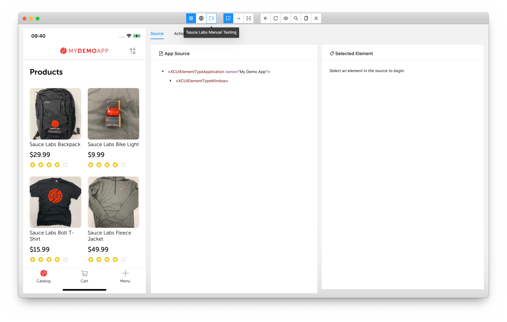
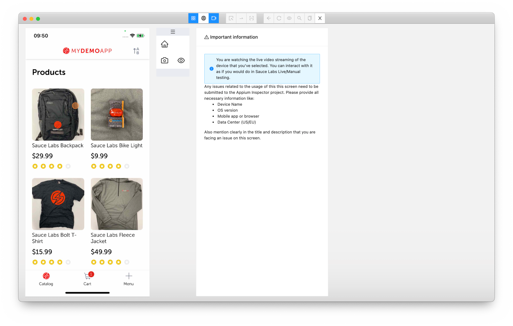
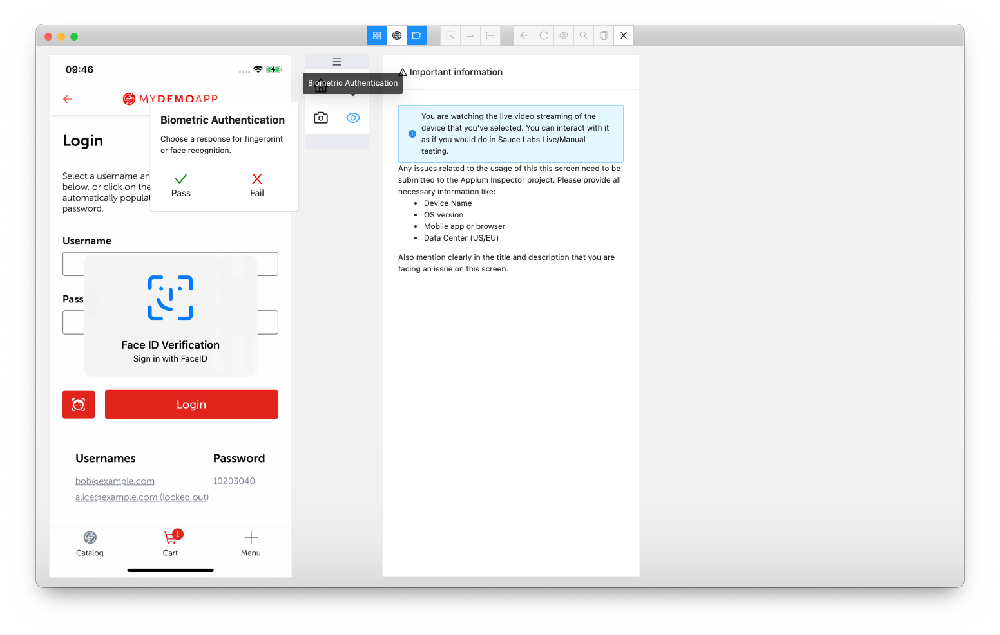
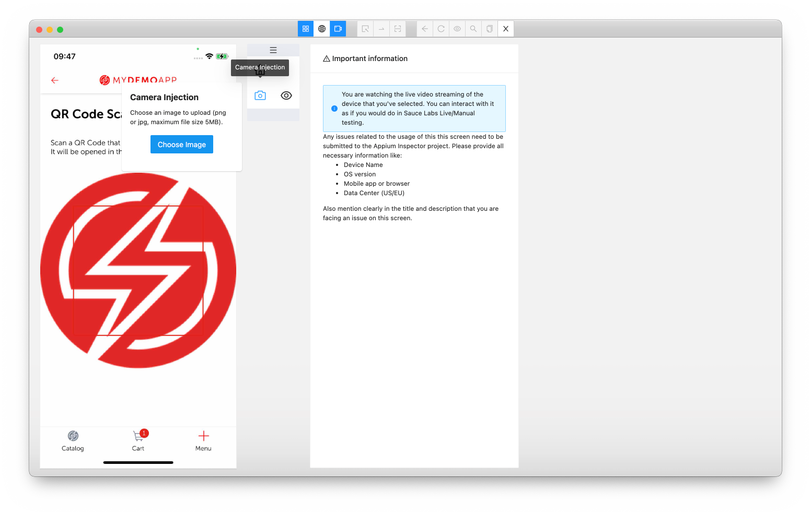

# Sauce Labs Manual Testing

Appium Inspector now allows you switch between getting the source code with Appium Inspector and manually test/walk through your app on Sauce Labs Real Devices.

> **NOTE:** This feature DOES NOT work on Sauce Labs Android Emulators or iOS simulators.

## How to use

- You can enable Live Testing on Sauce Labs Real Devices by clicking on the Video icon at the top of the screen, see the screenshot below.

  

- A new screen will be shown as seen below. In this screen you can interact with the device (with gestures or even with the keyboard by just start typing when an input field has focus) to get to the screen/state you want to go without manually interacting with your app as you would normally do with Appium Inspector. This will save you a lot of time.

  When you hover over the screen of the device you will see that you mouse will change into an orange dot, which mimics your finger.

  Click on the video icon again to get back to the source of the screen. Appium Inspector will automatically refresh the source and screenshot.

  

- Biometrics (FaceID/TouchID/Finger Print) is also supported. Click on the Eye-icon to select a successful or failed signal.

  

- Camera Injection can also be used by clicking on the Camera-icon and selecting an image to be uploaded.

  

## Issues

Any issues related to the usage of this this screen need to be submitted to the Appium Inspector project. Please provide all necessary information like:

- Device Name
- OS version
- Mobile app or browser
- Data Center (US/EU)

Also mention clearly in the title and description that you are facing an issue on this screen.
