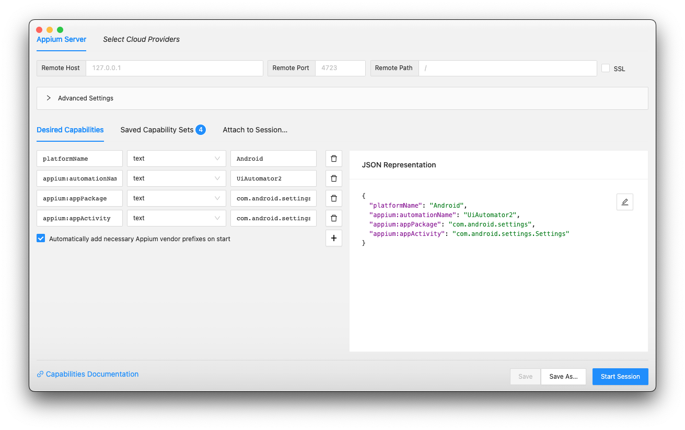

---
hide:
  - navigation

title: Overview
---

The main purpose of the Inspector is to provide inspection capabilities for the application page
source. It is primarily intended to be used in test automation development, but it can also be
useful in app development - or if one simply wants to take a look at an application's page source!

## Formats

The Inspector is distributed in two formats:

* Standalone desktop application for Windows, macOS, and Linux, available for download from
  [its GitHub repo](https://github.com/appium/appium-inspector/releases)
* Web application, available at <https://inspector.appiumpro.com>

Note that the web application may not be fully up-to-date with the desktop application.

## GUI Overview

There are two main parts to the Inspector user interface:

-   __The Session Configurator__
    
    The default screen, where all the server and session details must be specified.

-   __The Session Inspector__
    
    The active session screen, showing the app screenshot, page source, and more.

## Features Overview

In addition to page source and screenshot inspection, the Inspector provides many other useful
features. Here is a non-exhaustive list of such features:

* Easily define Appium server connection details and capabilities
* Save server details and capability sets for future sessions
* Connect to 10+ different cloud platforms
* Attach to an existing Appium session using its session ID
* Interact with the application through its screenshot (click/tap, swipe)
* Create and save custom gestures
* Select application elements directly through its screenshot
* Search for elements using supported locator strategies and your own selectors
* Interact with elements (click/tap, send keys, clear)
* View suggested element locator strategies and selectors to be used in your scripts
* Compare the speed of different element finding strategies
* Record your actions directly into Appium client code for 5+ different programming languages
* Simulate system actions for iOS (home, Siri) and Android (back, home, app switch)
* Switch to different application contexts
* Access a library of various Appium driver commands

All features are described in detail in the Session Configurator and Session Inspector sections.

## Under the Hood

Structurally, the Inspector is just an Appium client with a graphical user interface and additional
features.

* The rendered GUI components are built with React and Electron
* The Appium client functionality is provided by the [`web2driver`](https://github.com/headspinio/web2driver)
  module, which itself uses [WebdriverIO](https://webdriver.io/)
