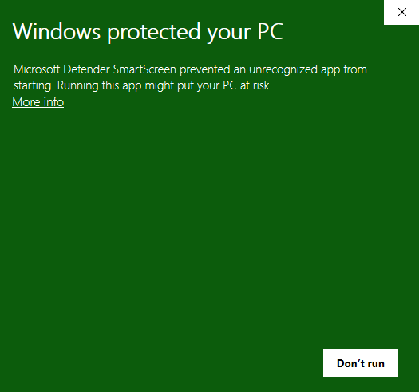
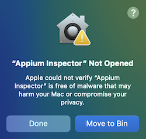
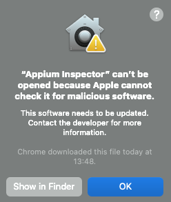

This step is only relevant if using the Inspector desktop app or Appium plugin formats.

## Appium Plugin

Like all Appium plugins, the Inspector plugin can be installed and activated using
[the Appium command line](https://appium.io/docs/en/latest/cli/).

1.  Install the plugin:
    1. For Appium 3:

        ```bash
        appium plugin install inspector
        ```

    2. For Appium 2 (last compatible version):

        ```bash
        appium plugin install --source=npm appium-inspector-plugin@2025.7.3
        ```

2.  Launch the Appium server with the plugin activated:

    ```bash
    appium --use-plugins=inspector --allow-cors
    ```

3.  Open the Inspector URL in your web browser:
    ```
    http://localhost:4723/inspector
    ```

!!! info

    Make sure the above **host URL** and **port** match those of the Appium server. The server's
    **base path** value is irrelevant, as the plugin always uses the `/inspector` path.

## Desktop App

The app can be downloaded from [the Inspector's GitHub repository](https://github.com/appium/appium-inspector/releases).
Different file formats are provided for each supported platform. In addition to manual downloads,
there are also unofficial ways to install the app using the command line.

### Windows

#### Manual Download

It is recommended to download the `.exe` installer file, as it supports [checking for updates](../menu-bar.md#update-checker).

Since the app is currently not signed, Windows will show a security warning to prevent you from
opening the installer file. This can be bypassed with sufficient user permissions:

??? info "Handling installation warnings on Windows"

    1. Right-click on the installer file and click _Properties_ - a new window should open.
    2. Near the bottom of the window, there will be an _Unblock_ checkbox - check it.
    3. Click _OK_.
    4. You should now be able to open the installer without issues.

    Alternatively, you can also bypass this after having opened the installer:

    1. Upon opening the installer, the following warning will likely be shown.
       
    2. Click _More info_ - a new button _Run anyway_ should appear at the bottom.
    3. Click _Run anyway_ - the installer window should open.

    After following the installer steps, the Inspector app should be installed, and you should be able
    to open it without any warnings.

#### WinGet

It is possible to install the Inspector through WinGet. Please note that this method is only
community-supported, and is not maintained by the Appium team.

```sh
winget install AppiumDevelopers.AppiumInspector
```

### macOS

#### Manual Download

It is recommended to download the `.dmg` installer file, as it supports [checking for updates](../menu-bar.md#update-checker).

Opening the file will open a simple window, showing icons for the Inspector and the _Applications_ folder.
Drag-and-drop the Inspector icon over the _Applications_ icon to extract the app.

Since the app [is currently not notarized](https://developer.apple.com/documentation/security/notarizing-macos-software-before-distribution),
macOS will show various security warnings to prevent you from opening the app for the first time.
These can be handled as described below:

??? info "Handling first-time warnings via command-line (any macOS)"

    Simply open your Terminal app and run the following command:

    ```
    xattr -cr "/Applications/Appium Inspector.app"
    ```

    You should now be able to open the app with no warnings.

??? info "Handling first-time warnings via GUI (macOS Sequoia or later)"

    !!! note

        If your Mac has an Apple chip, you can skip these steps by installing Appium Inspector v2024.9.1
        (which should not show any warnings), then using [the update checker](../menu-bar.md#update-checker)
        to upgrade to the most recent version.

    1. Upon opening the app, the following warning will be shown. Click _Done_.
       
    2. Open macOS Settings -> _Privacy & Security_, then scroll down to the _Security_ section. You should
    see the info text _"Appium Inspector" was blocked to protect your Mac._
    3. Click _Open Anyway_.
    4. A prompt should appear - click _Open Anyway_ again.
    5. A prompt should appear, requiring you to confirm the action using administrator user credentials.
    6. After confirming the action, the app should open.

??? info "Handling first-time warnings via GUI (macOS Sonoma or earlier)"

    1. Upon opening the app, the following warning will be shown. Click _OK_.
       
    2. Open _Finder_ -> _Applications_ and find Appium Inspector.
    3. _Control+Click_/click with two fingers on Appium Inspector and click _Open_.
    4. A prompt should appear - click _Open_ again.
    5. After accepting the prompt, the app should open.

#### Homebrew

It is possible to install the Inspector through Homebrew. Please note that this method is only
community-supported, and is not maintained by the Appium team.

!!! warning

    This method is deprecated and will be disabled on September 1st, 2026, since the app is not notarized.

```sh
brew install --cask appium-inspector
```

### Linux

It is recommended to download the `.AppImage` file, as it supports [checking for updates](../menu-bar.md#update-checker).

In order to open the file, its executable flag needs to be set first:

```
chmod a+x Appium-Inspector-<version>-linux-<arch>.AppImage
```

Afterwards, the app can be opened through the command line:

```
./Appium-Inspector-<version>-linux-<arch>.AppImage
```
