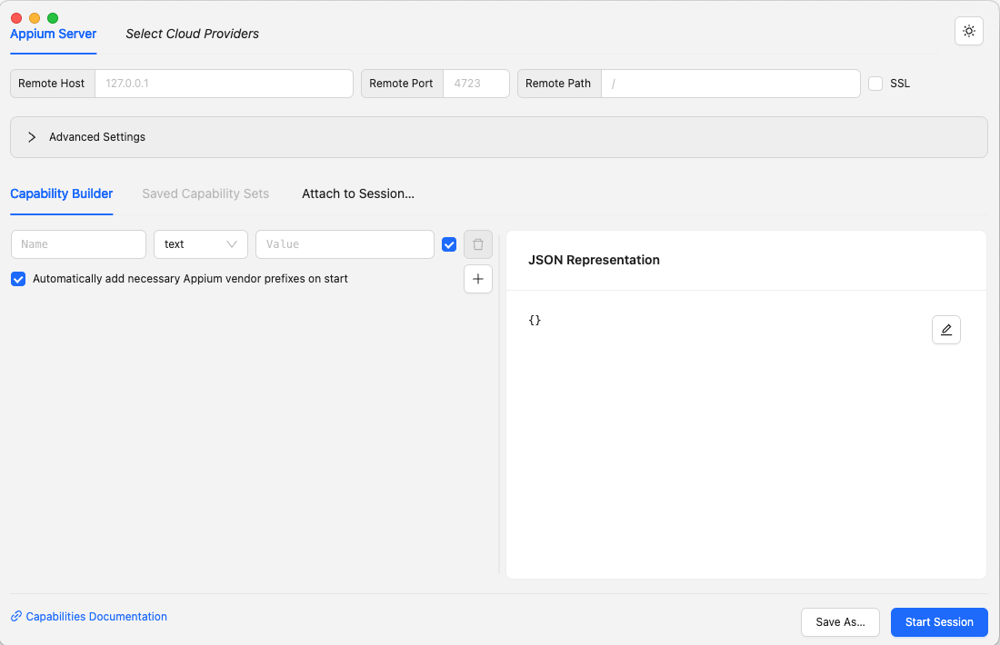
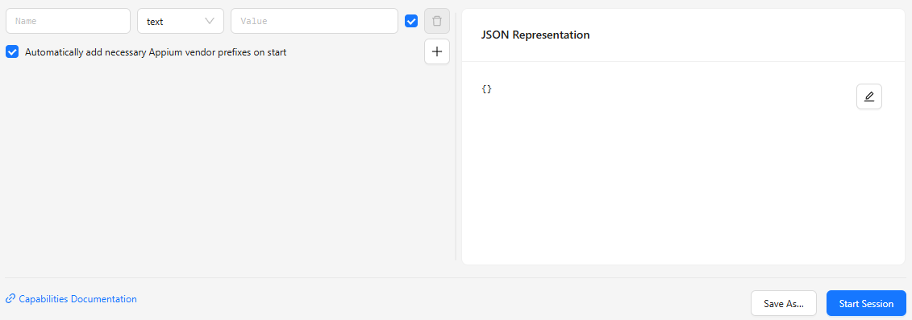
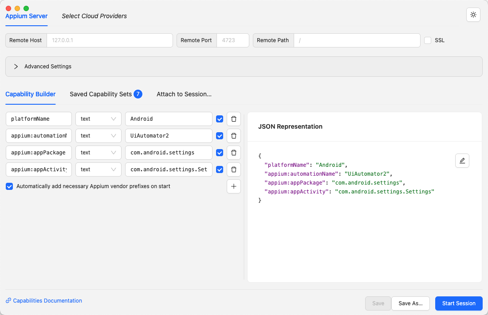

Now that the Inspector is installed (if necessary) and opened, you should be greeted with a screen
like this:



This is the [**Session Builder**](../session-builder/index.md) screen, where the server
and session details are specified.

## Adding Server Details


The [server details section](../session-builder/server-details.md) at the top of the window is where
information about the Appium server is specified, so that the Inspector knows how to connect to it:

- If you wish to connect to a cloud provider service, choose your vendor using the _Select Cloud
  Providers_ button, switch to its tab, and fill in the required details.

- If you wish to connect to a standalone local or remote Appium server, first make sure the server
  is launched and running. The start of the server log will have a list of IP addresses and ports
  that can be used to connect to the server.
    - For a local Appium server running on its default port, **all server details fields can be left
      unchanged**. By default, the Inspector will attempt to connect to `http://127.0.0.1:4723`,
      which matches the default values of the Appium server.

    - For a local or remote Appium server with non-default properties, please change the field
      values accordingly.

With the server details specified, you can move on to the session details!

## Adding Session Details



The [Capability Builder](../session-builder/capability-builder.md) take up the majority of the
Session Builder screen. This is the place where your session
[Capabilities](https://appium.io/docs/en/latest/guides/caps/) should be specified.

!!! warning

    Appium has several mandatory capabilities (see above link). Attempting to start a new session
    without any capabilities will not work.

You can enter these capabilities [one by one on the left side](../session-builder/capability-builder.md#capability-fields),
or you can [edit the whole capability set in JSON format on the right](../session-builder/capability-builder.md#capability-json-structure).
Choose your preferred input method.

So then, what capabilities should be entered? This depends on your target platform, and the Appium
driver that you want to use. Here are some basic capability sets not specific to any app:

=== "UiAutomator2"

    ```json
    {
      "platformName": "Android",
      "appium:automationName": "UiAutomator2"
    }
    ```

    Refer to the [UiAutomator2 driver capabilities documentation](https://github.com/appium/appium-uiautomator2-driver#general)
    for more details.

=== "XCUITest"

    ```json
    {
      "platformName": "iOS",
      "appium:automationName": "XCUITest",
      "appium:udid": "<device udid>"
    }
    ```

    Refer to the [XCUITest driver capabilities documentation](https://appium.github.io/appium-xcuitest-driver/latest/capabilities)
    for more details.

=== "Mac2"

    ```json
    {
      "platformName": "Mac",
      "appium:automationName": "Mac2"
    }
    ```

    Refer to the [Mac2 driver capabilities documentation](https://github.com/appium/appium-mac2-driver#capabilities)
    for more details.

Now that the capabilities are set, the session can be launched!

## Launching the Session

For a final check, here is an example image of a Session Builder with fully configured server
and session information:



You can see the following details:

- The server details are unchanged, which means the Inspector will try to connect to a local Appium
  server on its default port
- The session capabilities are set to use the UiAutomator2 driver, with additional capabilities for
  the Android system settings app

Of course, your own server and session details will likely vary.

You can now press the blue _Start Session_ button - hopefully your session will be created, in
which case the **[Session Inspector](../session-inspector/index.md)** screen will open:


If this works, you are done with the quickstart! You can now start exploring your app using the
various features described in the Session Inspector page.

If something went wrong, please check the [Troubleshooting](../troubleshooting.md) page for
potential issues.
