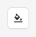

---
hide:
    - toc

title: Application Settings
---

The application settings can be accessed using the button in the top-right of the Session Builder screen.

The only currently available option is the ability to change the application theme. By default, the
Inspector will match the system theme, but it is also possible to explicitly switch to a light or
dark theme.
