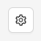

---
hide:
    - toc

title: Application Settings
---

The application settings can be accessed using the button in the top-right of the Session Builder screen.

## Theme

By default, the Inspector follows the system theme, but it is possible to explicitly switch to
a light or dark theme.

## Language

The language dropdown allows to change the entire application language. Currently there are over 20
available languages with community-provided translations!

!!! note

    Most languages only include partial translations. You can help by providing your translations on
    [Crowdin](https://crowdin.com/project/appium-desktop)!
