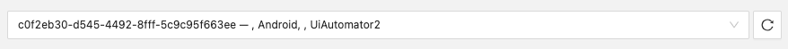

---
hide:
  - toc

title: Attach to Session
---

The Attach to Session tab of the Session Builder provides the ability to connect to an existing
Appium session using the Inspector.

The Inspector automatically tries to discover existing sessions when the application is opened.
If no sessions are discovered, the dropdown will be empty. But if there is at least one session,
the dropdown will populate with the session identifier and other details:

There is also a refresh button to retry the session discovery process.

!!! note

    The session discovery process uses the current [server details](./server-details.md). Make sure
    to select the correct server tab and enter the expected server details before pressing the
    refresh button.

The footer of this screen contains a link the Appium documentation, and a single button for
connecting to the selected session.
