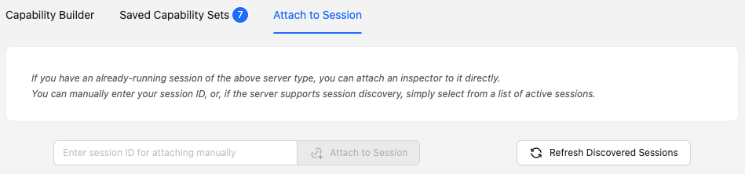
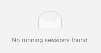
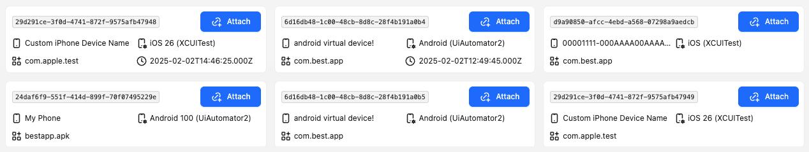

---
hide:
    - toc

title: Attach to Session Tab
---

The Attach to Session tab of the Session Builder allows attaching to an already-running session
[on the specified Appium server](./server-details.md).

There are 2 ways of attaching to a session:

* Manually entering the ID of the target session
* Selecting from a list of automatically discovered sessions

!!! warning

    Discovering sessions from servers running Appium 3 or later requires the server to have enabled
    the `session_discovery` [insecure feature](https://appium.io/docs/en/latest/guides/security/).
    Note that, even if session discovery is disabled, it is still possible to manually attach to a
    session using its ID.

Session discovery is run automatically upon switching to the Attach to Session tab, but there is
also a dedicated button for refreshing the list of discovered sessions.

If the server has no active sessions, or the discovery process failed (for example, if the target
server is running Appium 3 or later with session discovery disabled), an empty indicator is shown:

If the discovery process _does_ find one or more sessions, they are shown in a grid of cards, with
each card listing key information extracted from the session's capabilities, and a button to
attach to that session. The cards are sorted in reverse order, with the first card corresponding to
the most recently started session.

!!! note

    Support for discovering sessions from cloud provider-hosted servers depends on the provider. If
    the Inspector does not discover any sessions for your cloud provider, contact them to check
    whether they support this functionality.
