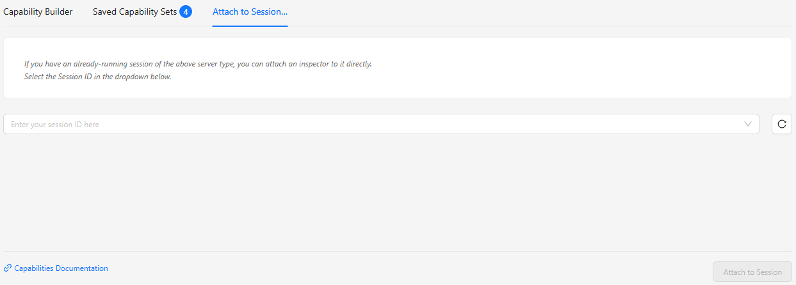
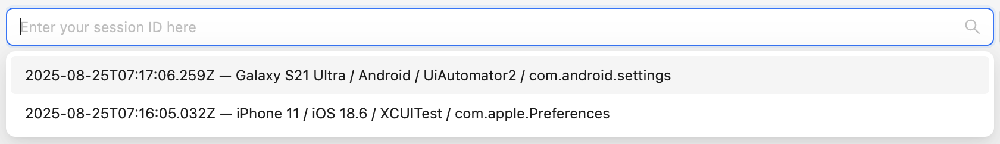

---
hide:
    - toc

title: Attach to Session Tab
---

The Attach to Session tab of the Session Builder provides the ability to connect to an existing
Appium session using the Inspector.

The Inspector will automatically try to discover existing sessions when the Attach to Session tab is
opened. The dropdown can then be opened to list all the discovered sessions and their details:

The most recently created sessions will be shown at the top of the list. If exactly one session is
discovered, the dropdown will also auto-populate with the details of that session.

Additionally, a refresh button is available to retry the session discovery process.

!!! note

    The session discovery process uses the current [server details](./server-details.md). Make sure
    to select the correct server tab and enter the expected server details before selecting the
    Attach to Server tab or pressing the refresh button.

The footer of this screen contains a link the Appium documentation, and a single button for
connecting to the selected session.
