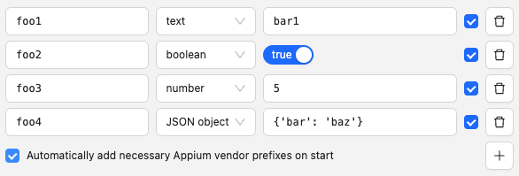
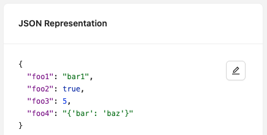
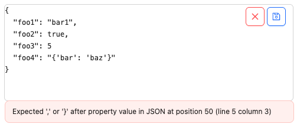

Most of the Session Builder screen is taken up by one of 3 tabs, of which the Capability Builder tab
is selected by default. As the name implies, this is the place where capabilities for the Inspector
session must be specified.

To learn more about capabilities, [please visit the Appium documentation](https://appium.io/docs/en/latest/guides/caps/).

## Capability Fields

The left side of the Capability Builder shows the capability fields editor. It provides several form
fields for specifying each capability in parts: its name, value type, and the value itself.

Changing the name or value of any capability will automatically adjust the contents of
[the JSON structure](#capability-json-structure) on the right side of the Session Builder.

There are 4 options for the value type:

-   text
-   boolean
-   number
-   JSON object

Selecting a different option may change the value input field.

!!! note

    Capabilities with nested objects, such as `chrome:options`, must be added by directly editing
    the [the JSON structure](#capability-json-structure).

To add or remove capabilities, use the add and delete buttons on the right side.

There is also a checkbox that allows automatically adding the Appium vendor prefix to capabilities
that do not have them, when starting a new session. This means that if you have a non-W3C capability
without a vendor prefix (e.g. `deviceName`), the Inspector will automatically add the `appium:`
prefix to it when starting the session (e.g. `appium:deviceName`). This checkbox is checked by default.

## Capability JSON Structure

The right side of the Session Builder also shows the current capabilities, but in the standard JSON
format, which may be more useful when working with code.

At the top right of the JSON structure, there is an Edit button, which allows adjusting the
capabilities by directly editing the JSON structure. Toggling this editor mode then shows buttons
for discarding any changes, or saving them. After saving, any changes will also be reflected in
[the capability fields](#capability-fields) on the left side of the Session Builder.

In order to assist with editing raw JSON, when attempting to save any changes, they are
automatically validated and rejected if they do not fit the JSON syntax:

## Footer

The Session Builder footer also contains a few items:

-   The _Capabilities Documentation_ link opens the [Appium documentation on capabilities](https://appium.io/docs/en/latest/guides/caps/)
-   The _Save As_ button allows saving the current capabilities as a new capability set for future use
    (see [Saved Capability Sets](./saved-capability-sets.md) for more details)
-   The _Start Session_ button attempts to start an Inspector session using the current capabilities
