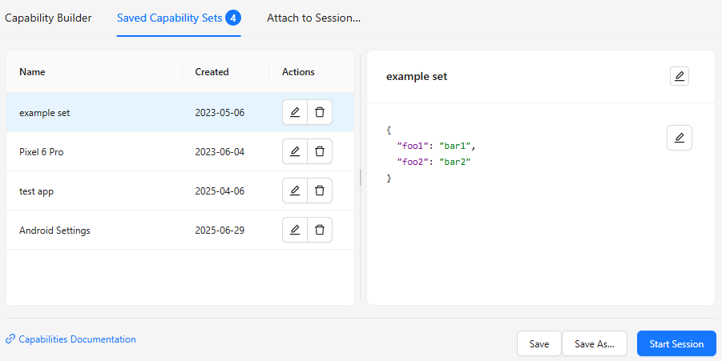
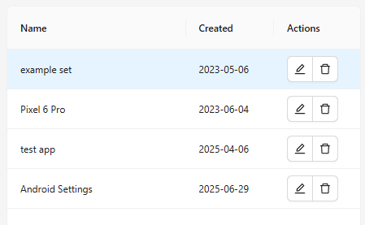

The Saved Capability Sets tab of the Session Builder is used for listing and configuring any saved
capability sets, which can be created using [the button in the footer of the Capability Builder tab](./capability-builder.md#footer).
Parts of this tab are similar to the Capability Builder tab.

The divider line in the middle of the tab can be used to adjust the widths of both halves of this
tab, as well as collapse/expand the right half.

## List of Saved Capability Sets

The left side of this screen contains a list of all saved capability sets. The number of saved sets
is also shown in the title of the Saved Capability Sets tab.

Selecting any set populates the JSON structure on the right side with the contents of the set.
The Actions column of each set also has 3 buttons:

- Open the set in the Capability Builder tab
- Export the set (along with the current session details) as an `.appiumsession` file
- Delete the set

There is also a button at the bottom of the saved capability sets list, which can be used to import
previously exported `.appiumsession` files and automatically add them to the list of saved
capability sets. Multiple files can be imported at the same time.

!!! tip

    If you have installed the standalone desktop app version, you can also open an `.appiumsession`
    file using your file manager/command line. This will launch the Inspector and load the session
    file details in the [Capability Builder tab](./capability-builder.md), which may be useful if
    you do not want to add it as a saved capability set.

## Saved Capability Set JSON Structure

The JSON structure on the right side shows the capabilities of the saved set in JSON format, exactly
like [in the Capability Builder tab](./capability-builder.md#capability-json-structure). One
additional functionality here is the ability to rename a saved set:

## Footer

The footer is largely similar to [that in the Capability Builder tab](./capability-builder.md#footer),
with one additional button:

- The _Save_ button is shown upon selecting any saved capability set, and is enabled after making
  any changes in its capabilities. Pressing it overwrites the capabilities in the saved set with the
  new changes.
