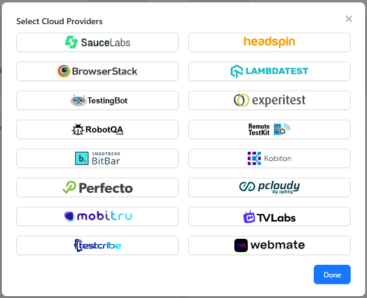
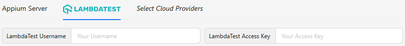

The top of the Session Builder screen is used to configure server details - that is, how the
Inspector should connect to the target Appium server.

By default, the _Appium Server_ tab is selected, which is used for connecting to a standalone local
or remote Appium server. However, it is also possible to connect to a server provided by a cloud
service. [See the section below for more details.](#cloud-providers)

## Default Server Detail Fields

The default server details have 4 fields:

- **Remote Host**: the host URL of the server (default: `127.0.0.1`)
- **Remote Port**: the port on which the server is running (default: `4723`)
- **Remote Path**: the base path used to access the server (default: `/`)
- **SSL**: whether HTTPS should be used when connecting to the server (default: `false`)

If using the placeholder details, the Inspector will try to connect to `http://127.0.0.1:4723/`.
If you have a locally-running Appium server that was launched with default parameters, it should
also be using this address, in which case you can leave the fields unchanged.

## Cloud Providers

Clicking the _Select Cloud Providers_ button opens a screen with various cloud providers that
support integration through Appium Inspector:

Selecting any provider then adds a new tab next to the default _Appium Server_ tab, and switching to
the provider's tab changes the available server detail fields. Different providers will have
different fields - for example, LambdaTest only requires the _username_ and _access key_:

## Advanced Settings

The _Advanced Settings_ options allow further configuration of the Appium server connection:

