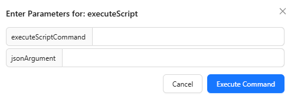

---
hide:
    - toc

title: Commands Tab
---

The Commands tab provides a way to execute various Appium driver commands through the Inspector GUI.

Most commands are grouped into various categories. Opening any category shows several buttons, each
of which corresponds to an Appium driver command.

!!! note

    Commands may be driver-specific, in which case their buttons may not be visible when using
    other drivers.

The available buttons may correspond to commands without parameters, and commands with parameters:

- For a command without parameters, clicking its button will execute the command
- For a command with parameters, clicking its button will open the parameter popup:

    

Some commands may require special conditions (e.g. they are only supported in simulators). This
additional information, if present, is shown as follows:

- For a command without parameters, this is shown by hovering over the button
- For a command with parameters, this is listed inside the parameter popup

Regardless of the command type, once it is run and its execution finishes, a new popup will show the
result returned by the command.

Depending on the command, it may also trigger a refresh for the application screenshot and source.
