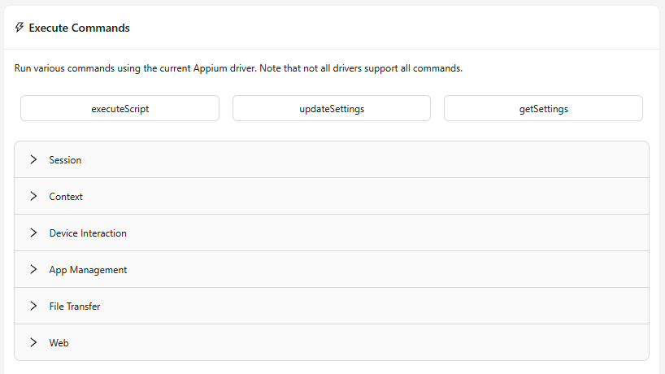

The Commands tab provides a way to run various Appium driver commands and
[execute methods](https://appium.io/docs/en/latest/guides/execute-methods/) through the
Inspector GUI.

The list of available commands and execute methods is tied to the active Appium driver: all drivers
support a set of [common protocol commands](https://appium.io/docs/en/latest/reference/api/),
but they can also define their own commands and execute methods. The Inspector retrieves all of
these commands/methods from the driver itself, and adjusts the list accordingly.

Appium _plugins_ may also define their own commands and execute methods. If such plugins are
active during an Inspector session, their commands/methods are also included in the Commands tab.

Note that there are two important limitations to this approach:

- The Commands sub-tab ^^**only lists the commands supported by [the WebdriverIO client](https://webdriver.io/).**^^
  Under the hood, the Inspector uses WebdriverIO to run all commands, therefore any command that is
  not defined in WebdriverIO (for example, any custom third-party driver command) will not work. Due
  to this, the Inspector simply filters out all such commands from the Commands list. This limitation
  does not apply to execute methods.

- ^^**Appium `2.16.0` or later is required.**^^ For older Appium versions, a predefined list of
  commands is shown instead. Please be aware that not all commands in the predefined list are
  compatible with all drivers.

## Navigation

The top of the Commands tab includes two sub-tabs, which can be used to switch between the
supported commands and execute methods. Since these lists can be lengthy, a search bar is also
available, which can be used to filter both sub-tabs simultaneously.

## Command Properties

Commands and execute methods may have additional properties specified by their driver/plugin:

- They may be marked as deprecated, in which case they are shown with a yellow-tinted background.
  Check the driver/plugin documentation for more details on these commands.

    

- They may include additional information, which is shown upon mouseover:

    

- They may support additional parameters, and clicking on them will open the parameters popup.
  Parameters can be either required or optional.

    

## Command Result

Upon finishing execution, any command or execute method will always trigger a new popup with the
command result:

The popup also has several buttons for interacting with the result:

### Toggle Table Formatting

Formats the result as a table, which provides sorting and filtering capabilities. Filters are not
shown for array or object values. Clicking on the contents of any table cell allows copying them to
the clipboard.

This button is enabled only if the command/method result is an array or object. While this button
is toggled on, the Copy Result button is disabled.

### Copy Result

Copies the result to the clipboard. Disabled while table formatting is active.
