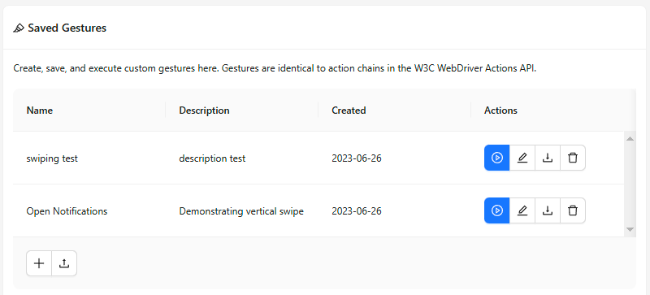
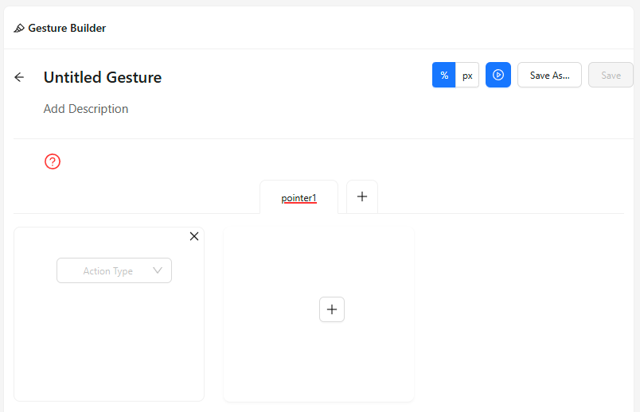

The Gestures tab allows to create, save, and execute custom gestures. By default, switching to this
tab opens the Saved Gestures screen.

## Saved Gestures

The default saved gestures list is empty, and must be populated by saving new gestures. This can be
done by pressing the `+` button in the bottom left, which will open the
[Gesture Builder](#gesture-builder) screen.

Once a gesture has been saved, its entry in the saved gestures list can be clicked, which will
toggle showing its expected path in the [Screenshot](./screenshot.md) panel. There are also 3
buttons for each gesture:

* Execute the gesture
* Edit the gesture (will open it in the [Gesture Builder](#gesture-builder))
* Delete the gesture

## Gesture Builder

The gesture builder is shown when creating a new gesture, or editing an existing one.

The builder screen can be divided into 4 parts:

* Header
* Gesture timeline
* Pointer tabs
* Pointer actions

### Header

The header lists general gesture information, settings, and actions.

* The gesture title and description can be clicked and edited
* The coordinate unit button group allows to set the X/Y coordinate units used for
  [Move pointer actions](#pointer-actions): relative (percentage, default) or absolute (pixels)
* The Play button executes the gesture
* The Save As button allows to save the gesture using the specified gesture title
* The Save button is only enabled when editing an existing gesture, and it overwrites the previously
  saved gesture details with the current ones

### Gesture Timeline

When creating a new gesture, there will be a red circle with a questionmark right below the gesture
description. This is the gesture timeline.

The default state of the gesture timeline indicates that the gesture only contains one undefined action.

The timeline can be modified by adding or modifying the [pointer actions](#pointer-actions). Here
is an example timeline for a simple swipe gesture:

From the icons it can be seen that the timeline contains the following actions:

1. Move to location
1. Pointer down
1. Move to location
1. Pointer up

### Pointer Tabs

The pointer tabs show the current number of pointers used in the gesture.

When creating a new gesture, only one pointer is added by default, but it is possible to have up to
5 pointers in the same gesture! Each pointer is underlined with its unique colour, and have a
separate row in the [gesture timeline](#gesture-timeline).

The pointer title can also be clicked and edited.

### Pointer Actions
