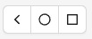

The header of the Session Inspector contains various buttons that are key to interacting with the
device itself or the application source.

## Device System Buttons

If using the Inspector with an Android or iOS device, the first button group in the header will be
the system buttons, which allow you to simulate the equivalent Android or iOS system functionality:

 

* Android: back / home / app switcher
* iOS: home / Siri
    * The Siri button will open a prompt for input text, which will be used as the Siri command.
      Please note that the command will not work if Siri is disabled.

## Context Switcher

The context switcher button group allows to change to a
[different application context](https://appium.io/docs/en/latest/guides/context/). By default, the
Inspector works in _native mode_, and makes no attempts to discover other contexts. Pressing the
globe icon will switch to _hybrid mode_, and the Inspector will start the context discovery process.

If no additional contexts are found, the button group will show a new yellow warning icon, which
in turn will show this explanation upon mouseover.

However, if the Inspector _does_ discover more contexts, a new dropdown will appear. There will
also be a new blue icon, which will show further information upon mouseover.

The current context can now be switched by selecting the new context in the dropdown.

!!! note

    The Inspector does not automatically switch the current context if a new one is discovered. This
    must be explicitly done using the dropdown.

## Toggle Automatic Source Refresh

!!! info

    This button is only visible when using MJPEG screenshotting capabilities like
    `appium:mjpegServerUrl`.

 

This button allows to disable or re-enable automatic refreshing of the application XML source, once
any changes are detected. This may be useful while interacting with the device through the screenshot,
and the application source is not as relevant. In cases where the XML source is complex and takes
some time to retrieve, disabling its retrieval allows for more seamless device interaction.

## Refresh Source & Screenshot

If the application screenshot and/or source have changed from the data last captured by the
Inspector, this button allows to trigger a manual refresh and retrieve the latest data.

## Search for Element

This button allows you to search for elements within the current application XML source. Opening it
will show a modal that allows entering the element search details:

It is possible to select the locator strategy to be used during element search. Different drivers
support different locator strategies, and the Inspector will try to hide strategies that are not
supported by the current driver.

After selecting the locator strategy, entering the locator string, and pressing Search, the results
screen is shown.

It is possible that no elements are found:

If one or more elements are found, the Inspector will list the element count, time taken, and a
list of selectable element IDs:

Selecting any element enables the element action buttons:

| Icon | Description |
| ---- | ------ |
|  | Attempt to select the element in the application source. Note that this may not work if the element ID has changed. |
|  | Tap the element |
|  | Enter text to send to the element, or clear its text |

## Toggle Recorder

 

This button allows to enable or disable recording of various user interactions with the application,
and translate them into code that can be used with various Appium clients.

Interactions that can be recorded include:

* Actions for a specific element (tap/send keys/clear)
* Generic tap/swipe actions on the application screenshot
* [System actions](#device-system-buttons)
* [Driver commands](./commands.md)

!!! note

    Recording of custom gestures is not currently supported.

While recording is enabled, the [Recorder tab](./recorder.md) is automatically populated with Appium
client code for all supported interactions.

## Quit Session

As the name implies, this button quits the Inspector session and returns to the
[Session Builder](../session-builder/index.md).
