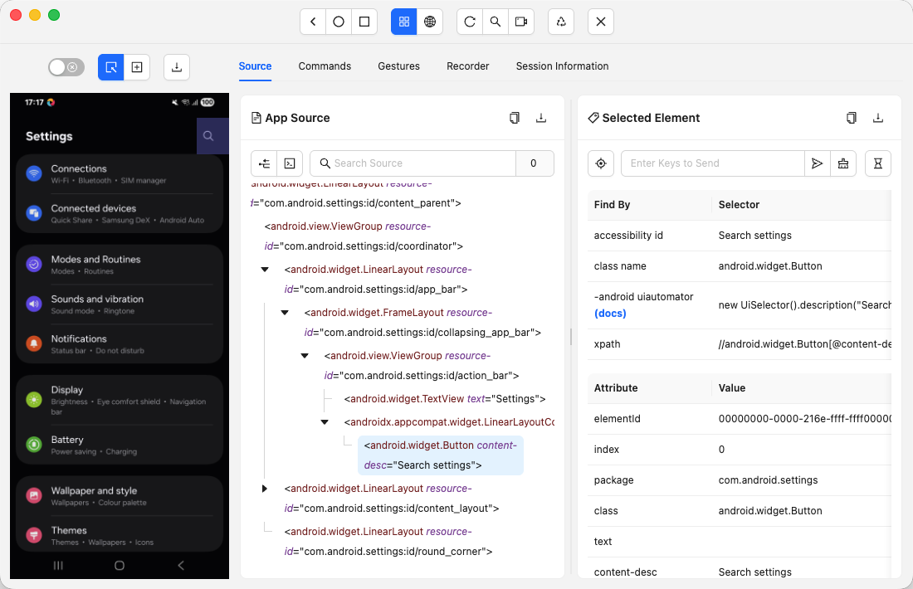

---
hide:
    - toc

title: Session Inspector Overview
---

The **Session Inspector** is the screen shown when connected to a session, and provides the majority
of the Inspector's functionality.

The user interface here can be divided into several groups:

- [Header (buttons and more)](./header.md)
- [The Screenshot panel](./screenshot.md)
- [Source tab](./source.md)
- [Commands tab](./commands.md)
- [Gestures tab](./gestures.md)
- [Recorder tab](./recorder.md)
- [Session Information tab](./session-info.md)
