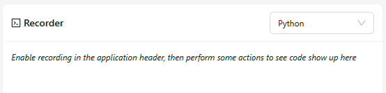
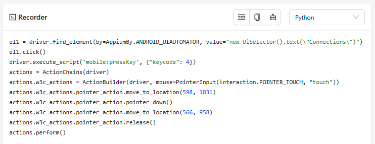

---
hide:
    - toc

title: Recorder Tab
---

The Recorder tab is used to record various Inspector interactions into executable code, for use with
various [Appium clients](https://appium.io/docs/en/latest/ecosystem/clients/).

By default, the tab contents are empty, since recording must be manually enabled in the
[Inspector header](./header.md#toggle-recorder). However, the dropdown in the top-right corner can
be used in advance to select the target language for the recorded code.

Refer to the [Toggle Recorder button documentation](./header.md#toggle-recorder) for a list of
interactions that can be recorded.

!!! tip

    The Recorder tab does not need to remain opened in order to record actions.

Once recording is enabled and a few actions are recorded, the tab contents are populated with the
generated code.

Changing the language in this state also changes the already-recorded code to the new language.

There are also a few management buttons shown next to the language dropdown:

- The boilerplate toggle button allows showing or hiding additional boilerplate code. This code is
  also shown in the [Session Information tab](./session-info.md#session-boilerplate).
- The copy button copies the currently recorded code to the clipboard. If enabled, boilerplate code
  is copied as well.
- The clear button deletes all the currently recorded code. Note that the recording state is not changed.
