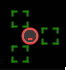
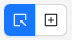

The Screenshot panel is shown on the left side of the Session Inspector. It shows a screenshot of
the current device screen, and also provides several ways of interacting with this screenshot.

## Supported Screenshots

The panel supports all screenshots regardless of dimensions, in any orientation:

The Inspector will try to automatically adjust how much of the window is taken up by the screenshot.
Currently, the limit is either the full window height, or 40% of the window width.

!!! note

    Handling of multiple screenshots (for multi-screen devices) is not currently supported.

## Refreshing the Screenshot

By default, the screenshot itself is a static image, which is only updated when a refresh is
requested, exactly like for the [Source tab](./source.md#refreshing-the-source). Interacting with
the application outside of the Inspector will _not_ cause the screenshot to refresh.

However, it _is_ possible to have the screenshot update automatically, and always mirror the actual
device screen, even when interacting with the device outside of the Inspector. This can be achieved
by using MJPEG session capabilities, such as `appium:mjpegServerPort`.

## Screenshot Panel Header

The panel header contains several interface elements that allow interacting with the screenshot in
various ways.

### Element Handles Toggle

This switch toggles the visibility of highlighter handles for all identified elements.

!!! info

    Highlighter handles are only visible in [Element Mode](#interaction-mode).

Highlighter handles can be very useful if there are multiple elements overlapping around the same
coordinates. Such element handles are merged together in a single group handle, identified by the
`+` symbol. This group handle can then be clicked to reveal the individual highlighter handles,
enabling the selection of each individual element.

### Interaction Mode

The Interaction Mode buttons allow switching between the default Element Mode, and the Coordinates
Mode. The differences are as follows:

| 
Mode
 | Description                                                                                                                                                                                                                                                                                              |
| --------------------------------- | -------------------------------------------------------------------------------------------------------------------------------------------------------------------------------------------------------------------------------------------------------------------------------------------------------- |
| Element Mode                      | In this mode, hovering over the screenshot will highlight any detected elements. Clicking on any highlighter will then select the corresponding element in the [application source](./source.md#application-source), and show its details in the [selected element panel](./source.md#selected-element). |
| Coordinates Mode                  | In this mode, the top left corner of the screenshot will show an coordinates overlay. Hovering over the screenshot will update this overlay with the coordinates on the device screen, and clicking or swiping the screenshot will execute a tap/swipe action on the device.                             |

### Download Screenshot

!!! info

    This button is not visible when using MJPEG screenshotting capabilities like
    `appium:mjpegServerUrl`.

This button allows to save the currently shown screenshot to your computer as a `.PNG` file.
