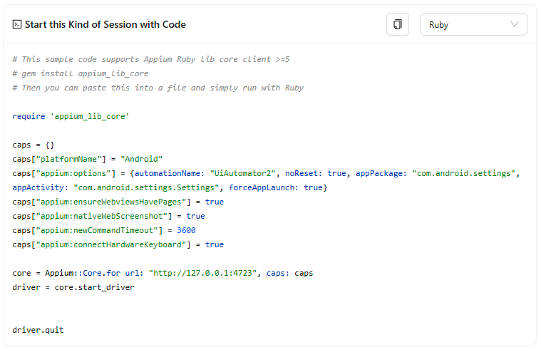

The Session Information tab can be used as a reference for the current state of the session.

It can be divided into two parts: the informational tables at the top, and the session boilerplate
at the bottom.

## Informational Tables

These tables provide general information about the session, such as its URL, server details,
capabilities, and so on. The _Server Details_ and _Session Details_ sub-tables can be scrolled for
further information.

## Session Boilerplate

This codeblock provides example boilerplate code that can be used to create a session with the
currently used server and session details. It includes all the necessary imports, setup, and
teardown for creating a session in a single, self-contained file.

The copy button in the top-right corner can be used to copy the code to the clipboard, whereas the
dropdown can be used to change the target language.
