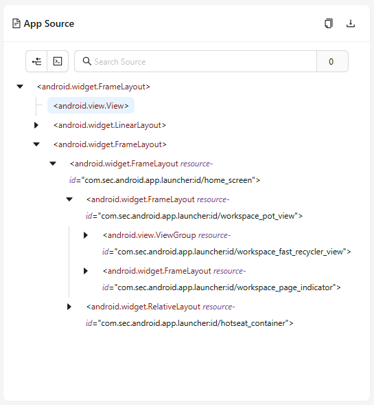

The Source tab is the default tab opened after starting an Inspector session. It can be divided into
two connected parts: the Application Source panel, and the Selected Element panel.

## Application Source

The Application Source is the central panel of the Source Tab. It shows the application source XML
in a tree-like structure, and provides a few additional buttons in the top right corner.

Element entries in the XML tree can be interacted with: if clicked, the tree entry is selected, its
element highlighter shown in the [Screenshot panel](./screenshot.md), and the element details shown
in the [Selected Element panel](#selected-element).

## Selected Element