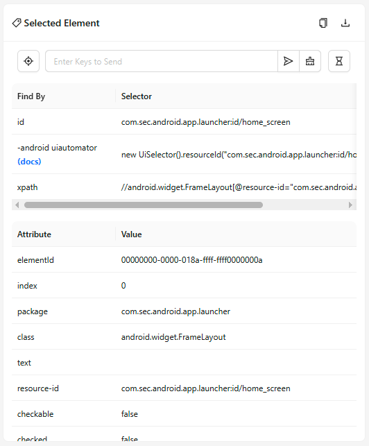
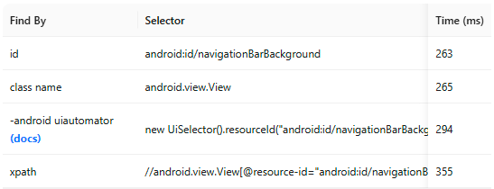

The Source tab is the default tab opened after starting an Inspector session. It can be divided into
two connected parts: the Application Source panel, and the Selected Element panel.

## Application Source

The Application Source is the central panel of the Source Tab. It shows the application source XML
in a tree-like structure, and provides a few additional buttons in the top right corner.

The application source tree is generated from the XML data returned by the Appium driver. By
default, the tree only shows the class name for each element entry, along with several 'important'
attributes such as `value` and `content-desc`. All non-'important' attributes are hidden by default
for ease of navigation, but can be revealed with the [Toggle Attributes button](#toggle-attributes-button).

All elements in the XML tree are interactable, and clicking on one causes 3 actions:

-   The element entry in the XML tree is highlighted
-   The element highlighter appears in the [Screenshot panel](./screenshot.md) (if
    [Element Mode](./screenshot.md#interaction-mode) is selected)
-   The element details are shown in the [Selected Element panel](#selected-element)

Elements that have one or more child elements have an arrow on their left side, which can be clicked
to toggle visibility of such child elements.

For supported Appium drivers, the maximum depth of the returned XML tree can be adjusted with the
`snapshotMaxDepth` setting.

### Refreshing the Source

By default, the source XML is only updated when a refresh is requested. This can happen when:

-   interacting with an element (tap/send keys/clear)
-   interacting with the [screenshot](./screenshot.md) (tap/swipe)
-   [simulating system actions](./header.md#device-system-buttons)
-   [executing driver commands](./commands.md) (depends on the command)
-   [executing custom gestures](./gestures.md)
-   [pressing the Refresh button](./header.md#refresh-source-screenshot)

Note that interacting with the application outside of the Inspector will _not_ cause the source XML
to refresh.

The use of MJPEG session capabilities (such as `appium:mjpegServerPort`) allows to modify this
behavior. While the default source refresh behavior in MJPEG mode stays the same, the mode adds the
[automatic source refresh button](./header.md#toggle-automatic-source-refresh) in the application
header, which allows to disable automatic refreshing.

### Toggle Attributes Button

This button allows to show/hide all non-'important' element attributes in the source tree:

### Copy XML Button

This button copies the full application XML source to the clipboard.

### Download XML Button

This button allows to download the full application source as an `.xml` file.

## Selected Element

The Selected Element panel is shown on the right side of the Source tab. It is empty by default, but
becomes populated once an element is selected.

In order to populate the panel, an element can be selected in one of the following ways:

-   Selecting an entry in the [Application Source](#application-source)
-   Selecting a highlighter in the [Screenshot panel](./screenshot.md)
-   Clicking the [Reveal Element in Source button in the Search Results](./header.md#search-for-element)

The panel can be divided into 3 parts: element action buttons, suggested locators, and element
attributes.

### Element Action Buttons

| Icon                                                                                     | Description                                                                       |
| ---------------------------------------------------------------------------------------- | --------------------------------------------------------------------------------- |
|                             | Tap the element                                                                   |
|  | Enter text to send to the element, or clear its text                              |
|                            | Copy the element attributes to the clipboard as an array of JSON objects          |
|       | Download a screenshot of the element as a `.PNG` file                             |
|                            | Run a timing comparison for the [suggested element locators](#suggested-locators) |

### Suggested Locators

This table lists one or more locator strategies + selectors that can be used to find the element.
Clicking on a selector copies it to the clipboard.

Pressing the [timing comparison](#element-action-buttons) button executes a search for each of the
listed strategies + locators, and adds a new table column with the elapsed time until the element
was returned.

### Element Attributes

This table lists all attributes retrieved from the element, along with their values. Clicking on a
value copies it to the clipboard.

Refer to your [Appium driver](https://appium.io/docs/en/latest/ecosystem/drivers/) documentation for
ways to customize the attributes shown in this table.
